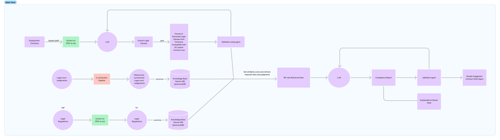
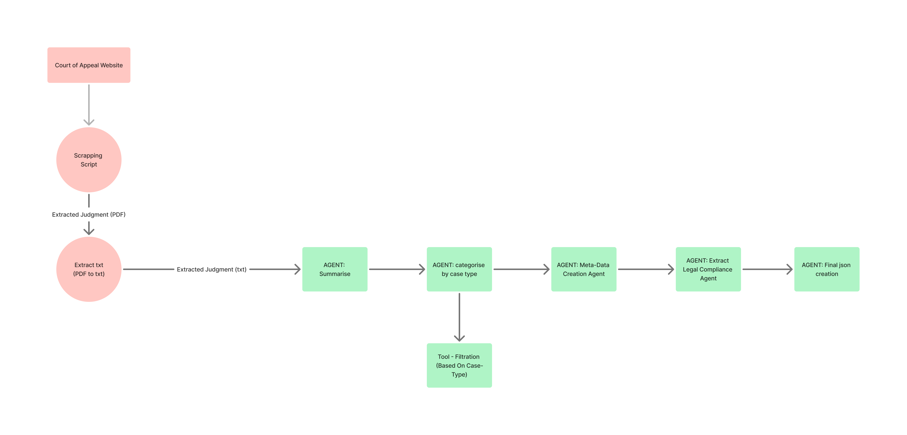

# Legora API


## Overview
The **Legal Document Analysis API** is designed to process and analyze legal documents using an AI-powered pipeline. It utilizes **FastAPI** for serving requests and **CrewAI** for orchestrating the document analysis workflow. The system is integrated with MongoDB for session and document metadata storage.

## Architecture
The API follows a **multi-agent architecture** leveraging CrewAI to manage document extraction and analysis. The overall architecture is illustrated below:

### System Architecture


### Data Extraction Pipeline


## Features
- **Asynchronous processing** using FastAPI background tasks.
- **CrewAI pipeline** for document processing.
- **MongoDB integration** for session and document metadata storage.
- **RESTful API endpoints** for job submission, status retrieval, and document access.
- **Error handling and logging** for debugging and monitoring.

## API Endpoints

### 1. Submit a Document for Analysis
**Endpoint:** `POST /analyze-document`

**Request Body:**
```json
{
  "user_name": "JohnDoe",
  "pdf_path": "path/to/document.pdf"
}
```

**Response:**
```json
{
  "session_id": "123e4567-e89b-12d3-a456-426614174000",
  "status": "queued",
  "agentops_url": "",
  "trigger_start_time": "2025-03-18T12:00:00Z",
  "expected_finish_time": "2025-03-18T12:05:00Z",
  "message": "Document analysis job queued successfully"
}
```

### 2. Check Job Status
**Endpoint:** `GET /job-status/{session_id}`

**Response:**
```json
{
  "session_id": "123e4567-e89b-12d3-a456-426614174000",
  "status": "running",
  "message": "CrewAI pipeline execution started",
  "agentops_url": "https://app.agentops.ai/sessions/{trace_id}"
}
```

### 3. Retrieve All Jobs
**Endpoint:** `GET /jobs`

### 4. Get All Documents Metadata
**Endpoint:** `GET /documents`

### 5. Retrieve Document Metadata by ID
**Endpoint:** `GET /document/{document_id}`

## Technologies Used
- **FastAPI** - API framework
- **MongoDB** - Database for storing job and document metadata
- **CrewAI** - AI agent framework for document analysis
- **Python** - Backend development
- **Uvicorn** - ASGI server

## Setup and Installation
1. **Clone the repository:**
   ```sh
   git clone https://github.com/your-repo/legal-document-analysis-api.git
   cd legal-document-analysis-api
   ```
2. **Install dependencies:**
   ```sh
   pip install -r requirements.txt
   ```
3. **Set up environment variables:**
   Create a `.env` file with the following:
   ```ini
   username=your_mongo_username
   Password=your_mongo_password
   MONGO_URI=your_mongo_uri
   MONGO_DB=legal_analysis
   ```
4. **Run the API server:**
   ```sh
   uvicorn api:app --host 0.0.0.0 --port 8000 --reload
   ```
